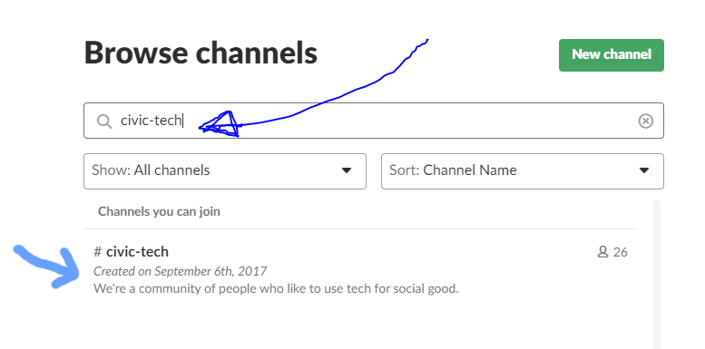
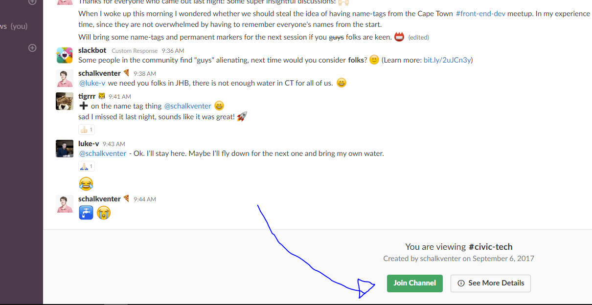

# 💬 Joining the #civic-tech channel

## Overview

[Slack](https://slack.com/) is a real-time web-based chat program that connects communities. You can either use it in your browsers or download the desktop/mobile app.

Our `#civic-tech` channel is part of _'ZA Tech'_, a larger Slack community for those interested/working within the tech field in South Africa. 

## Instructions

_Note: Click on the arrows to view the screenshots associated with the steps._

1. <strong>Go to: [https://www.zatech.co.za](https://zatech.github.io/site/)</strong>

2. 

Click on the <strong>'Slack'</strong> button to receive an invite to join <em>'ZA Tech'</em>.

3. 

Enter your email address.

4. 

You should receive the following email. Continue by pressing the <strong>'Join Now'</strong> button.

5. 

Fill in your account details, and press the <strong>'Next'</strong> button.

5. 

Accept the Slack Terms and Conditions

6. 

Slack will ask you if you want a little explainer on how to use Slack or if you want to skip the tutorial. <strong>Choose either one of these options</strong>.

7. 

<You have now successfully joined <em>ZA Tech!</strong> If you want to join or <em>#civic-tech</em> channel you can click on <strong>'Channels'</strong> button (The text <em>'Channels'</em> itself) in the sidebar (this allows you to explore all channels on <em>'ZA Tech'</em>)

9. 

Type <strong>civic-tech</strong> into the search bar, and click on <em>#civic-tech</em> once it shows up in the results.

10. 

You are now viewing our <em>#civic-tech</em> channel. In order join it you can click the <strong>'Join Channel'</strong> button on the bottom of the page.

11. 

Congratulations you are now part of our <em>#civic-tech</em> channel! You can share resources or questions by using the <strong>Message #civic-tech</strong> field at the bottom, followed by the <em>'enter'</em> key to submit it.

12. Finally, in order to return to the <em>#civic-tech</em> channel you visit <strong>[https://zatech.slack.com/messages/C6ZT26F0E/](https://zatech.slack.com/messages/C6ZT26F0E/)</strong>. It might be a good idea to bookmark this in your browser for easy reference.

13. That's it! We look forward to hearing from you!